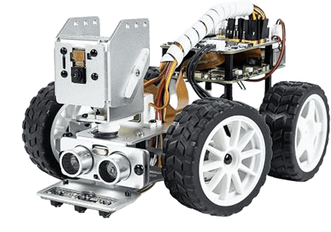

# 🛑 PiCar-X Traffic Sign Recognition

> Auto autónomo basado en Raspberry Pi 5 + PiCar-X que reconoce señales de tránsito en tiempo real con YOLOv8 y reacciona en consecuencia: frena, gira, cambia de velocidad y anuncia por voz lo que detecta.

<p align="center">
  
</p>

<p align="center">
  
  
  
  
</p>

---

## Demo

▶️ **[Ver el video de la demo](https://drive.google.com/file/d/1WWgtIXTUVIPsnL_vW4e2Ag4E438TXWOr/view?usp=sharing)**

---

## Qué hace?

El auto corre un modelo **YOLOv8** entrenado a medida (fine-tuning sobre pesos COCO) para detectar **10 clases de señales de tránsito** sobre un circuito armado en casa, y reacciona en tiempo real:

| Señal | Clase | Reacción del auto |
|---|---|---|
| 🛑 Pare | `pare` | Se detiene unos segundos |
| 🚶 Peatón | `peaton` | Se detiene unos segundos |
| ⚠️ Ceda el paso | `ceder` | Se detiene unos segundos |
| ⚠️ Peligro | `peligro` | Reduce la velocidad |
| 🔄 Contramano | `contramano` | Gira a la derecha para desviarse de la ruta en contramano |
| ➡️ Derecha | `derecha` | Gira a la derecha |
| ⬅️ Izquierda | `izquierda` | Gira a la izquierda |
| 🟢 Avance | `avance` | Retoma velocidad de crucero |
| 2️⃣0️⃣ Velocidad 20 | `vel20` | Reduce a velocidad límite |
| 3️⃣0️⃣ Velocidad 30 | `vel30` | Aumenta a velocidad límite |

Además:
- **Anuncia por voz** cada señal detectada (texto-a-voz con `espeak-ng`, reproducido en una compu remota vía WiFi).
- **Transmite video en vivo** con las detecciones dibujadas sobre el cuadro (`/video`, MJPEG), visible desde cualquier navegador en la red.
- Filtra detecciones por **confianza** y por **tamaño relativo del cartel en el cuadro**, para no reaccionar a señales demasiado lejanas o inciertas.

---

## El modelo

- **Arquitectura:** YOLOv8n (nano), elegido por ser el más liviano para correr en la Pi.
- **Transfer learning** desde pesos preentrenados en COCO (`yolov8n.pt`).
- **Dataset:** etiquetado y versionado en Roboflow, split 70/20/10 (train/valid/test), con augmentación offline x3 en el set de entrenamiento.
- **Corrida final:** reproducible con [`notebooks/sign_traffic_recognition_final_train.ipynb`](notebooks/sign_traffic_recognition_final_train.ipynb). Es el modelo guardado en `modelo_final/`.
- **Exportado a `.tflite`** para inferencia eficiente en la Raspberry Pi.
- **Ajuste clave:** se desactivó el flip horizontal (`fliplr=0.0`) durante el entrenamiento — con el flip activado, el modelo confundía sistemáticamente `izquierda`/`derecha`, porque la augmentación espeja la imagen pero no intercambia la etiqueta de la clase.

---

## Hardware

- Raspberry Pi 5
- Kit PiCar-X (SunFounder) — cámara, servos de dirección
- Red WiFi local (para el stream de video y el audio remoto)

---

## Instalación

```bash
git clone https://github.com/tatic2003/picarx-sign-recognition.git
cd picarx-sign-recognition

# Dependencias en la Raspberry Pi
pip install -r requirements.txt
```

Copiá el modelo `modelo_final/best_sin_flip.tflite` a la Raspberry Pi y ajustá la ruta en `MODEL_PATH` dentro de `sign_movement_final.py`.

> `picarx` y `vilib` son librerías propias de SunFounder y no están en PyPI — se instalan con el script oficial del fabricante (ver comentarios en `requirements.txt`). `espeak-ng` es un paquete del sistema (`sudo apt install espeak-ng`), no de pip.

---

## Uso

**En la Raspberry Pi** (controla el auto y transmite el video):
```bash
python sign_movement_final.py
```
El stream queda disponible en `http://<ip-de-la-pi>:8080/video`.

**En tu computadora** (recibe y reproduce los anuncios de voz):
```bash
python audio_server.py
```

> Antes de correr el auto, actualizá `WINDOWS_IP` en `sign_movement_final.py` con la IP actual de tu computadora (`ipconfig` en Windows / `hostname -I` en Linux).

---

## Parámetros ajustables

Todo lo que se suele querer tunear está centralizado al principio de `sign_movement_final.py`:

```python
CRUISE_SPEED = 12          # velocidad de crucero
VEL20_SPEED = 5            # velocidad al detectar "vel20"
VEL30_SPEED = 30           # velocidad al detectar "vel30"
MIN_BOX_AREA_RATIO = 0.025         # qué tan cerca debe estar el cartel de giro para reaccionar
MIN_BOX_AREA_RATIO_IMMEDIATE = 0.03  # ídem para pare/peatón/ceder/etc.
ACTION_COOLDOWN = 8.0       # segundos mínimos entre dos reacciones a la misma señal
```

---

## Estructura del repo

```
.
├── sign_movement_final.py     # script principal: detección + manejo autónomo
├── audio_server.py            # servidor de audio (corre en la compu, no en la Pi)
├── modelo_final/
│   ├── best.pt                                        # pesos del modelo final (PyTorch)
│   └── best_sin_flip.tflite                           # el mismo modelo exportado para la Raspberry Pi
├── dataset/
│   └── signal_recognition_picarx.yolov8.zip           # dataset (train/valid/test) en formato YOLOv8
├── notebooks/
│   ├── sign_traffic_recognition_final_train.ipynb     # entrenamiento final (sin flip horizontal)
│   └── model_evaluation.ipynb                         # evaluación final sobre el set de test
├── picar-x.png                # imagen del auto para este README
├── requirements.txt
└── README.md
```

---

## Contexto

Proyecto desarrollado para la materia de Robótica — Maestría en Ciencias de la Inteligencia Artificial, FIUNA (Facultad de Ingeniería, Universidad Nacional de Asunción).

**Autores:** Tatiana Caballero — [GitHub](https://github.com/tatic2003), Ricardo Romero, Diego Baez. 